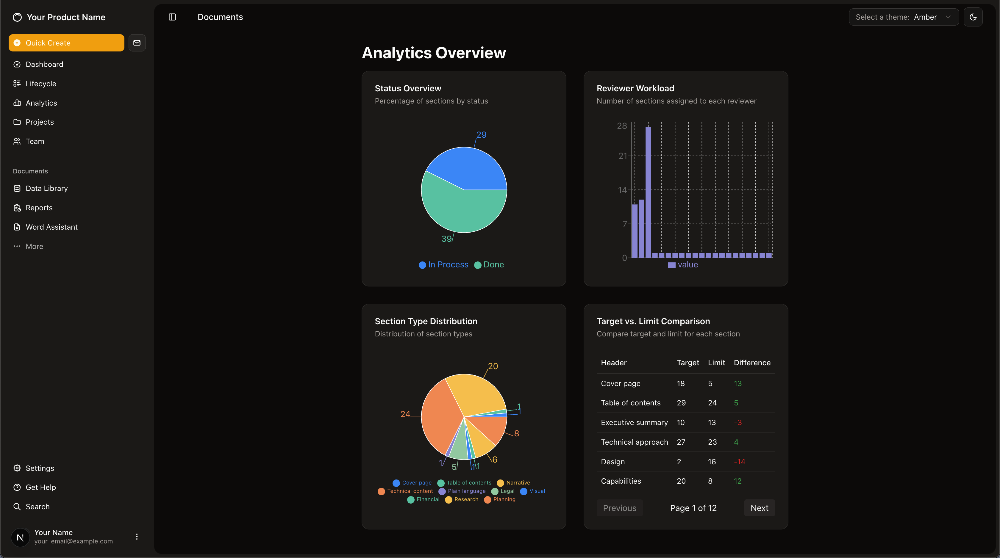
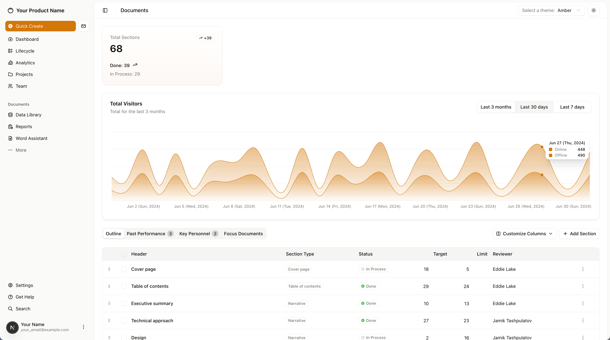
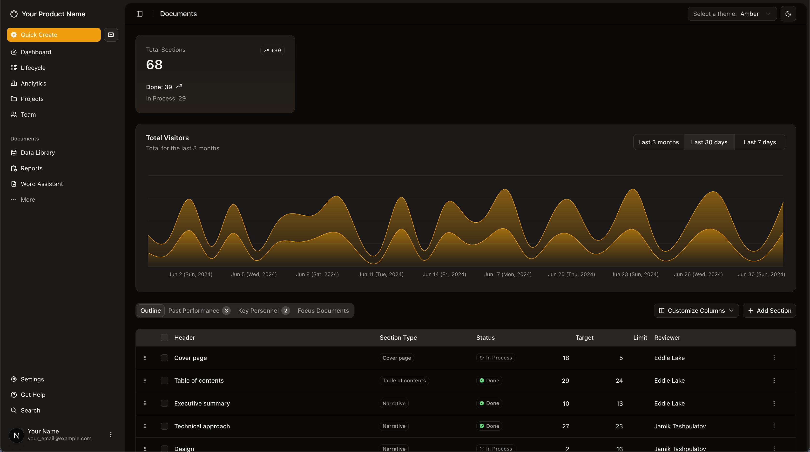
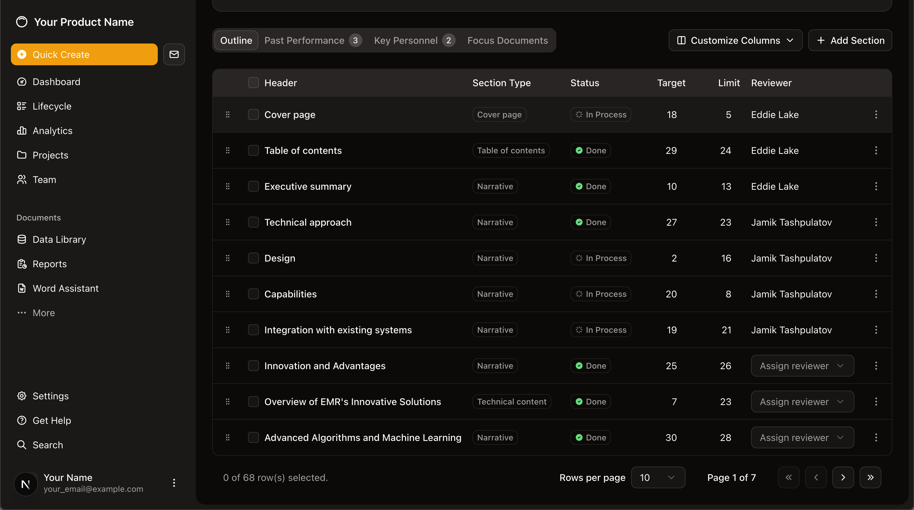

# Modern Dashboard Application






## Problem Statement

Managing and tracking the progress of complex documents and team workflows is often time-consuming and error-prone. Organizations need a way to:
- Monitor document section progress and reviewer workload
- Quickly identify bottlenecks and overdue sections
- Visualize key analytics (status, types, reviewer distribution)
- Adapt to both light and dark mode for modern work environments

## Solution: Modern Dashboard

This application provides a comprehensive dashboard for document lifecycle management, analytics, and team collaboration, built with Next.js, Supabase, and modern UI libraries.

### Key Features

- **Analytics Overview**: Visualize section status, reviewer workload, and section type distribution with interactive charts.
- **Live Data Table**: Track all document sections, their status, targets, limits, and assigned reviewers. Supports drag-and-drop, pagination, and inline editing.
- **Past Performance**: Instantly see completed sections in a dedicated, paginated view.
- **Theme Support**: Seamless switch between light and dark modes for optimal readability.
- **Customizable Columns**: Choose which data columns to display for a personalized experience.
- **Quick Create & Navigation**: Fast access to key actions and pages from the sidebar.
- **Responsive Design**: Works beautifully on both desktop and mobile devices.

### How It Works

- Data is fetched and updated live from Supabase, ensuring real-time accuracy across all users.
- Analytics and charts are generated from actual document and reviewer data for actionable insights.
- The UI is built with accessibility and modern UX best practices in mind.

## Getting Started

First, run the development server:

```bash
npm run dev
# or
yarn dev
# or
pnpm dev
# or
bun dev
```

Open [http://localhost:3000](http://localhost:3000) with your browser to see the result.

You can start editing the page by modifying `app/page.tsx`. The page auto-updates as you edit the file.

This project uses [`next/font`](https://nextjs.org/docs/app/building-your-application/optimizing/fonts) to automatically optimize and load [Geist](https://vercel.com/font), a new font family for Vercel.

---

For more details, see the screenshots above and explore the codebase!
